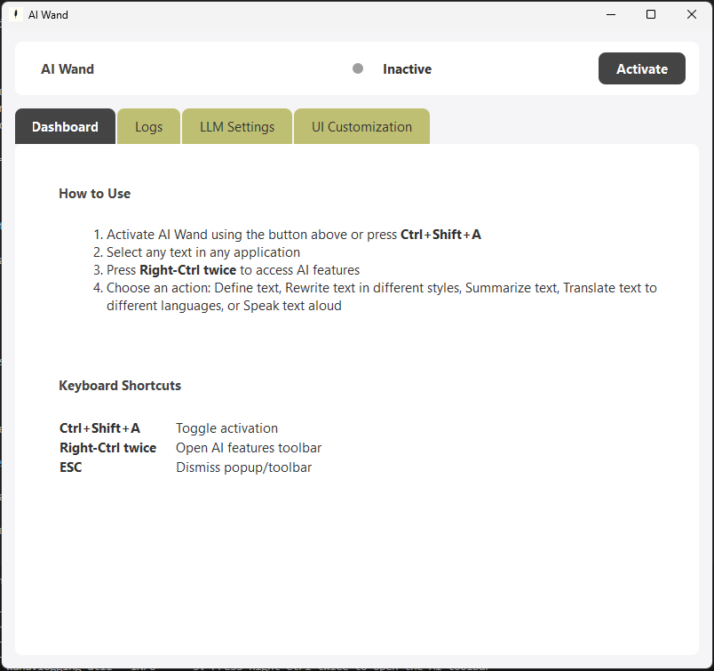
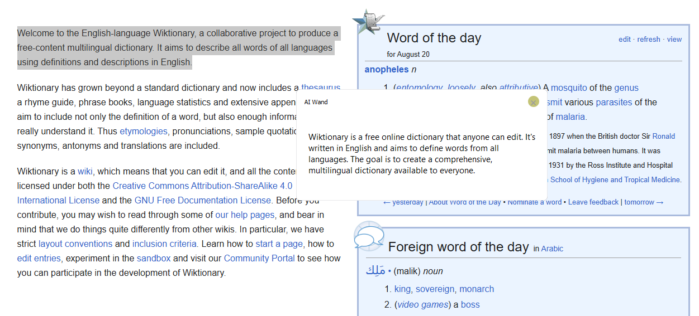
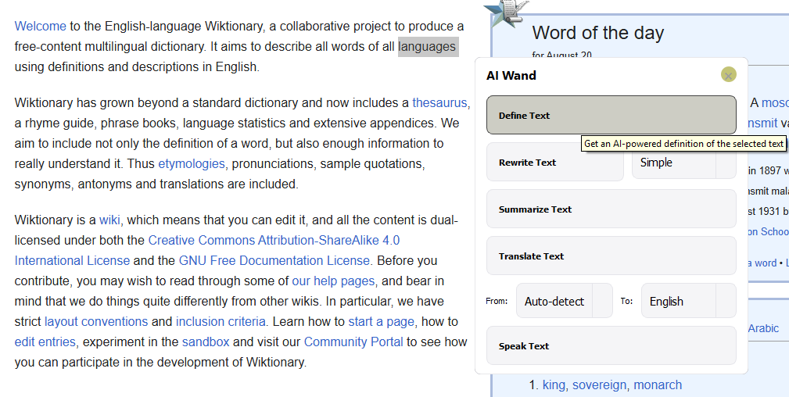
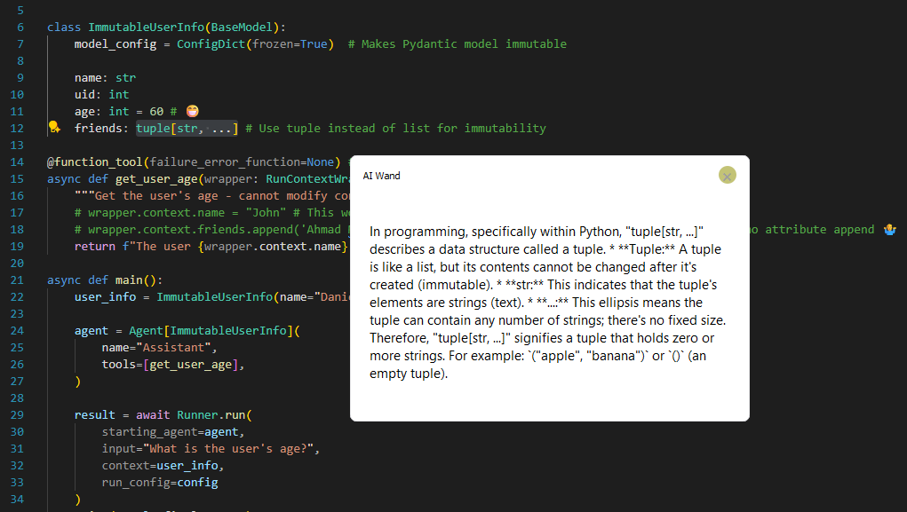

# AI Wand

AI Wand transforms how you interact with text across your desktop. Select any text in any application to instantly define, rewrite, summarize, translate, or have it read aloud - all through an elegant floating toolbar.

<div align="center">
  
  <h3>Smart Desktop Assistant</h3>
  <p>Enhance your productivity with AI-powered text operations</p>
  
  [](LICENSE)
  [](https://www.python.org/downloads/)
  [](https://pypi.org/project/PyQt5/)
  [](https://github.com/basenai/aiwand/actions)
</div>

<br clear="all">

## Key Features

- **Smart Text Operations** - Get definitions, summaries, rewrites, and translations instantly
- **Voice Integration** - Natural text-to-speech with playback controls
- **Minimal Interface** - Distraction-free design with hotkeys and floating toolbar
- **AI Powered** - Seamless LLM integration (OpenAI/Gemini compatible)
- **Fully Customizable** - Personalize appearance, behavior, and AI settings

## Quick Links

- [Official Website](https://aiwand.vercel.app/)
- [Report Issues](https://github.com/basenai/aiwand/issues)


<div align="center">
  <p><strong>Dashboard</strong></p>
  

  <p><strong>Definition Popup</strong></p>
  

  <p><strong>Toolbar</strong></p>
  

  <p><strong>Cross-Environment</strong></p>
  
</div>

## Installation

### Quick Start

1. Install Python 3.9+
2. Create a virtual environment and install dependencies:
   ```bash
   python -m venv .venv
   .venv\\Scripts\\activate  # Windows
   pip install -e .            # installs runtime deps
   # or: pip install -r requirements.txt
   ```
3. Configure API keys (optional):
   ```bash
   cp .env.example .env
   # Edit .env with your API keys
   ```
4. Launch the application:
   ```bash
   python main.py
   # or
   python -m aiwand.app
   ```

### Requirements

- **OS Support**: Windows only
- **Runtime deps**: Managed via `pyproject.toml` / `requirements.txt` (PyQt5, pynput, pyperclip, pyttsx3, openai, openai-agents, pywin32 on Windows)
- **Dev deps**: `pytest`, `pytest-cov`, `ruff`, `black`, `mypy`

Note: PyQt5 wheels are used; no system Qt installation required.

## Usage

### Basic Controls

| Action | Shortcut |
|--------|----------|
| Toggle AI Wand | <kbd>Ctrl</kbd>+<kbd>Shift</kbd>+<kbd>A</kbd> |
| Show AI Toolbar | Double-press <kbd>Right Ctrl</kbd> |

### Workflow

1. **Activate** AI Wand using <kbd>Ctrl</kbd>+<kbd>Shift</kbd>+<kbd>A</kbd>
2. **Select** any text in any application
3. **Access** the AI toolbar by double-pressing <kbd>Right Ctrl</kbd>
4. **Choose** an action:
   - **Define** - Get detailed explanation
   - **Summarize** - Condense text
   - **Rewrite** - Rephrase content
   - **Translate** - Convert to another language
   - **Speak** - Text-to-speech playback

## Configuration

### AI Setup

Configure AI settings through the application UI:
- Base URL (Gemini compatible)
- API Key
- Model selection
- Response parameters

### Environment Variables

Create a `.env` file or configure in-app:
```
GEMINI_API_KEY=your_api_key_here
```

## Development

### Project Structure

```
aiwand/
├── app.py            # Entry point for CLI
├── app_main.py       # Main controller
├── ui/               # Interface components
├── services/         # TTS and core services
├── agents/           # AI operation modules
└── core/             # Utilities and helpers
tests/                # Test suite
main.py               # Development runner
```

### Development Setup

```bash
# Install in development mode
pip install -e .

# Install development tools
pip install ruff black mypy pytest pytest-cov

# Format and lint
black .
ruff check --fix .

# Run tests (Windows headless)
PowerShell:
$env:QT_QPA_PLATFORM='offscreen'; $env:PYTEST_DISABLE_PLUGIN_AUTOLOAD='1'; pytest -rA -vv
```

### Quality Assurance

- **Formatting**: Black + Ruff (py39 target)
- **Linting**: Ruff
- **Testing**: pytest with headless Qt support
- **CI**: GitHub Actions workflow for Windows

### Troubleshooting

- **Windows + uv selecting PyQt5-Qt5**: If you use uv on Windows and encounter an error about `PyQt5-Qt5` wheels, prefer `pip install -e .` (as above). The project is configured to avoid this on Windows, but pip is the most reliable path.

## Contributing

We welcome contributions from the community! Please see our [Contributing Guide](CONTRIBUTING.md) for details.

### Contribution Workflow

1. Fork the repository
2. Create a feature branch
3. Implement changes with tests
4. Run quality checks
5. Submit a pull request

All contributors must adhere to our [Code of Conduct](CODE_OF_CONDUCT.md).

## Current Goal

- Customizable keyboard shortcuts
- Advanced text selection modes
- Enhanced TTS with neural voices
- Context-aware operations
- On-Screen Chat interaction
- Native Desktop App

## License

[MIT License](LICENSE) © 2025 [BasenAI](https://github.com/basenai) • AI Wand ([Daniel Hashmi](https://github.com/danielhashmi))
